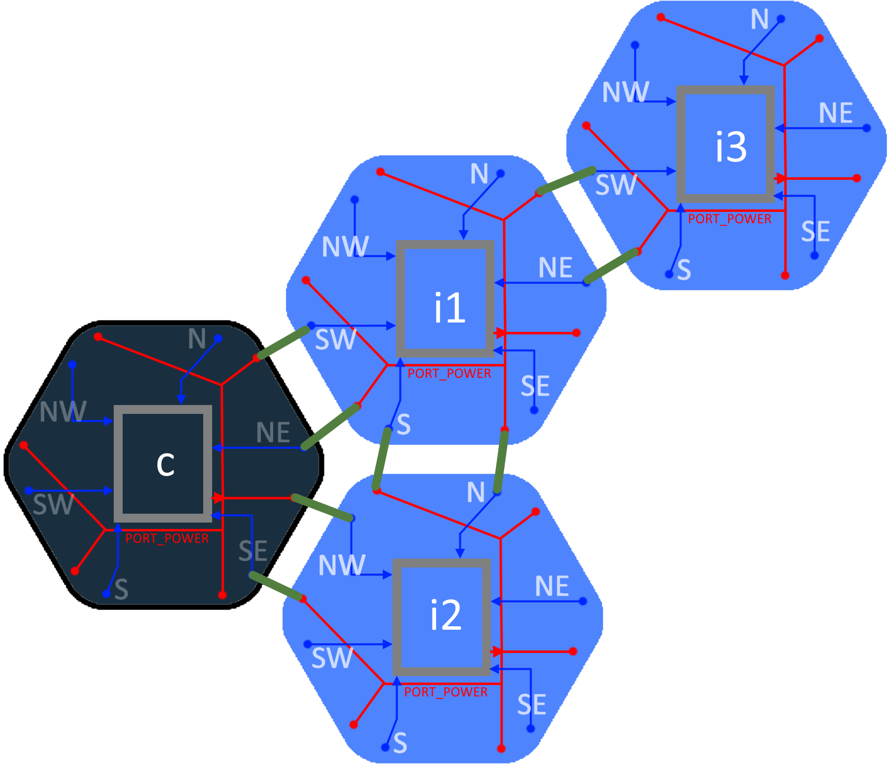

# Hardware Design for Communication

Communication is established via a **two-way communication bus**, such as `I2C`.

## Node GPIO Configuration for auto detection 

Each node is configured with the following GPIO setup:

- **Output GPIO:**
  - `PORT_POWER`: Provides power to connected neighbors. This output is shared across all 6 ports.

- **Input GPIOs:**
  - Six GPIO pins are assigned as digital inputs to detect potential neighbors in the following directions:
    - `N`  (North)
    - `NE` (North-East)
    - `SE` (South-East)
    - `S`  (South)
    - `SW` (South-West)
    - `NW` (North-West)

## Neighbor Detection Logic

A node detects a neighbor by checking the state of its directional input pins.  
If an input pin reads **HIGH**, it means that there is an active neighbor in that direction.  
The HIGH signal is supplied by the neighbor's `PORT_POWER` pin.

### Example

If the `N` input pin of a node is **HIGH**, it indicates the presence of a neighbor to the North.  
That signal is being powered by the `PORT_POWER` output of the northern neighbor node.



# Discovery Algorithm

This is a two phases algorithm:

1. Identify all nodes in the network → a list of IDs

2. For each node, do:
   - Turn off `PORT_POWER` pin.
   - Each node that detects the above change reports:
     - Its own ID
     - The edge (direction) that lost power
   - Turn back on the `PORT_POWER` pin.

## Phase 1
```pseudo
-> BroadCastMSG("ReportPresence") 
<- I1, I2, I3 
```
Layout 

| Node| Neighbours|
|-|-|
| C||
| I1||
| I2||
| I3||


## Phase 2

P2. find which nodes are near C and where
```pseudo
->SendMSG(“PortPowerOFF“, C)
<-[I1,SW] , [I2,NW]
->SendMSG(“PortPowerON“, C)
```
Layout 

| Node| Neighbours|
|-|-|
| C||
| I1|[SW:C]|
| I2|[NW:C]|
| I3||

P3. find which nodes are near I1
```pseudo
->SendMSG(“PortPowerOFF“, I1)
<-[C,NE],[I2,N],[I3,SW]
->SendMSG(“PortPowerON“, I1)
```
Layout 

| Node| Neighbours|
|-|-|
| C|[NE:I1]|
| I1|[SW:C]|
| I2|[NW:C],[N:I1]|
| I3|[SW:I1]|


P4. find which nodes are near I2
```pseudo
->SendMSG(“PortPowerOFF“, I2)
<-[C,SE] , [I1,S]
->SendMSG(“PortPowerON“, I2)
```
Layout 

| Node| Neighbours|
|-|-|
| C|[NE:I1],[SE:I2]|
| I1|[SW:C],[S:I2]|
| I2|[NW:C],[N:I1]|
| I3|[SW:I1]|

P4. find which nodes are near I3
```pseudo
->SendMSG(“PortPowerOFF“, I3)
<-[I1,NW]
->SendMSG(“PortPowerON“, I3)
```
Layout 

| Node| Neighbours|
|-|-|
| C|[NE:I1],[SE:I2]|
| I1|[SW:C],[S:I2],[NW:I3]|
| I2|[NW:C],[N:I1]|
| I3|[SW:I1]|